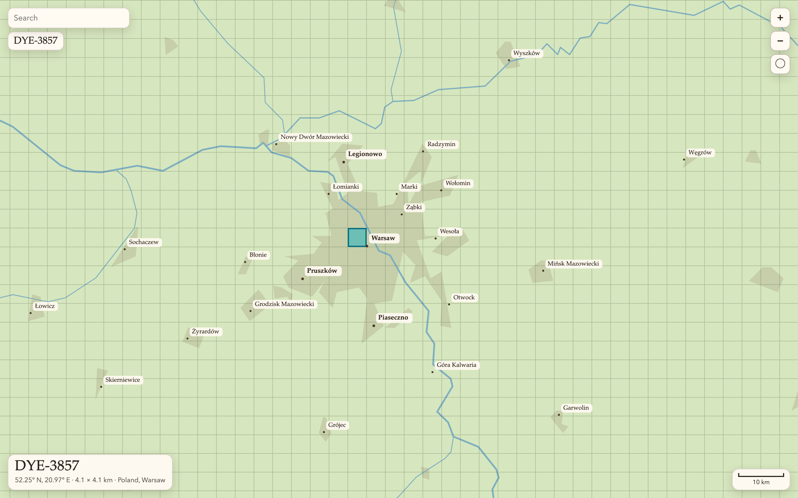
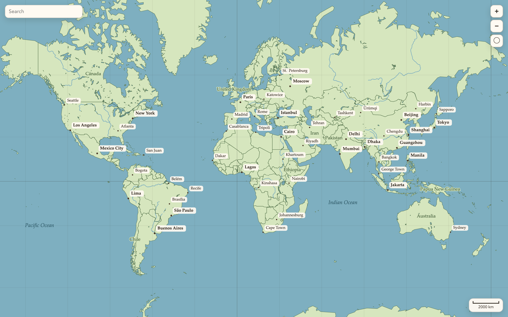
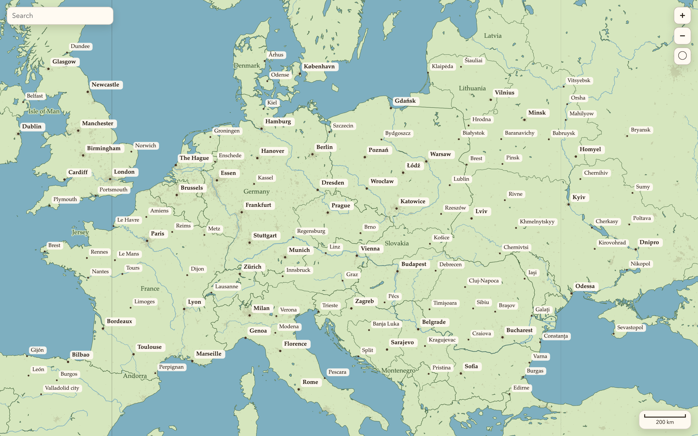

# Gridatlas

An offline world map split into selectable windows of about 4 km. No map service, no API keys, no tiles to download. The geography is baked into two JavaScript files, and a window id is plain math on latitude and longitude.



## Windows

The earth is cut into 6,016 columns and 4,880 rows. Every window has the same size in degrees, which makes it about 4.1 km by 4.1 km at Warsaw's latitude. That size is not arbitrary. Four times as large is the size for which Warsaw's city bounds fall on exactly four windows, with the cross between them in the middle of the city. Each of those is split 4 by 4, so the cross stays on a grid line and Warsaw covers 8 by 8 windows.

A window id is its column letters and its row number, like `DYF-3857`. Column `A` starts at 180° west, row `1` is the southernmost band, and a window owns its south and west edges. The same point always lands in the same window, on any device, with no lookup.

## Use the windows without the map

```js
import { windowAt, windowFromId } from "./src/gridatlas.js";

const place = windowAt(52.23, 21.01);
place.id;       // "DYF-3857"
place.center;   // { lat: 52.248, lon: 21.0339 }
place.bounds;   // { west, south, east, north }
place.widthKm;  // 4.1
place.heightKm; // 4.1

const again = windowFromId("DYF-3857");
```

Store `place.id` in metadata. `windowFromId` turns it back into a center and a bounding box.

## Show the map

```js
import { GridMap } from "./src/gridatlas.js";

const map = new GridMap(document.querySelector("#map"), {
  onSelect(win) {
    console.log(win.id, win.country, win.near);
  },
});

map.flyTo(52.23, 21.01, { windowsAcross: 24 });
```

Scroll or pinch to zoom, drag to move, click a window to choose it. The net of windows appears once they are large enough to see. Arrow keys, `+`, `-` and `0` work when the map has focus.

| Option | What it does |
| --- | --- |
| `onSelect(win)` | Called when a window is chosen. `win.country` and `win.near` (the nearest city and its distance) are filled in. |
| `onHover(win)` | Called as the pointer moves over windows, with `null` when it leaves. |
| `readout` | `false` hides the window readout in the bottom left corner. |
| `inset` | Padding, or a function returning padding, that labels stay inside. |
| `avoid` | A function returning screen rectangles that labels keep away from, such as your own panels. |

| Method | What it does |
| --- | --- |
| `flyTo(lat, lon, { windowsAcross, padding })` | Moves to a point, zoomed so that many windows fit across. |
| `selectAt(lat, lon)` | Chooses the window under a point. |
| `highlight(windows)` | Outlines windows, given as objects or ids. |
| `getSelection()` | The chosen window, or `null`. |
| `fitWorld()` | Shows the whole world. |
| `destroy()` | Removes the map and its listeners. |

## Find places

```js
import { searchPlaces, nearestPlace, countryAt } from "./src/gridatlas.js";

searchPlaces("krak");       // [{ name: "Kraków", country: "Poland", lat, lon, pop }]
nearestPlace(52.23, 21.01); // { name: "Warsaw", km: 0.4, ... }
countryAt(52.23, 21.01);    // "Poland"
```

Search ignores accents and letter case, so `krakow` finds Kraków and `lodz` finds Łódź.

## What is on the map

About 26,000 cities and towns, country borders, coastlines, rivers and lakes. Labels thin out as you zoom out, so the biggest cities always win. Seas, lakes and rivers share one color.

`src/atlas.js` (3 MB) loads with the map and draws the world view. `src/detail.js` (6 MB, 2 MB gzipped) follows in the background and takes over once you zoom in: coastlines, borders, lakes and rivers at 1:10m, and built-up areas.

Built-up areas are shaded a little darker than the land, so you can see where cities and towns really are. They appear once you zoom in to about a continent, they are clipped to the coastline, and they cover every area of about 5 square kilometers or more, worldwide.





## Demo

```bash
npm run check
python3 -m http.server 8765
```

Open `http://localhost:8765`. The page opens on Warsaw with a search field in the corner.

## Rebuild the geography

The raw files live in `raw/`, which is not in the repository:

- From [Natural Earth](https://www.naturalearthdata.com/): `countries.geojson` (1:50m admin 0 countries), `lakes.geojson` (1:50m lakes), `rivers.geojson` (1:50m rivers and lake centerlines) and `places10.geojson` (1:10m populated places). For the detail layers, the 1:10m files under their own names: `ne_10m_admin_0_countries`, `ne_10m_lakes`, `ne_10m_lakes_europe`, `ne_10m_lakes_north_america`, `ne_10m_rivers_lake_centerlines`, `ne_10m_rivers_europe` and `ne_10m_rivers_north_america`, all `.geojson`.
- From [Wikidata](https://www.wikidata.org/): `cities.csv`, made by `npm run fetch-cities`.
- From [NASA](https://www.earthdata.nasa.gov/): `urban.geojson`, made by `npm run fetch-urban`. It cuts the built-up class out of the MODIS land cover map. It needs Python, set up once:

```bash
python3 -m venv .venv
.venv/bin/pip install -r scripts/urban-requirements.txt
npm run fetch-urban
```

The tiles come from NASA's public image service, GIBS, so no login is needed. About 80 MB is kept in a temporary folder, so a second run is fast. To choose another folder, run `npm run fetch-urban -- --cache <folder>`. The result is clipped to the 1:10m land minus its lakes, so those files must be in `raw/` first. `npm run fetch-urban -- --clip-only` redoes only the clipping.

Then:

```bash
npm run pack
```

That rewrites `src/atlas.js` and `src/detail.js`. If `raw/urban.geojson` is missing, the built-up areas already in `src/detail.js` are kept.

## Data

Coastlines, borders, rivers, lakes and the larger cities come from Natural Earth, which is public domain. Towns of 10,000 people or more come from Wikidata, which is CC0. Built-up areas come from the NASA MODIS Land Cover Type product (MCD12Q1 version 6.1, class 13, "Urban and Built-up Lands", 500 m, year 2024), which NASA releases as CC0. None of them asks for credit, so the map shows none.

NASA does ask users to cite its data when they publish work based on it. For the record: Friedl, M., Sulla-Menashe, D. (2022). MODIS/Terra+Aqua Land Cover Type Yearly L3 Global 500m SIN Grid V061. NASA Land Processes DAAC. https://doi.org/10.5067/MODIS/MCD12Q1.061

## License

Copyright 2026 Kacper Kotowski.

Gridatlas is released under the [PolyForm Noncommercial License 1.0.0](LICENSE). You may use, change and share it for any noncommercial purpose: personal projects, study, research, hobby work, and use by schools, charities and public institutions. You may not use it to make money, for example in a product or service that is sold, or in work done for a paying client.

For commercial use, ask the author for a separate license.

The license covers this code and the packed atlas. The Natural Earth, Wikidata and NASA data stay public domain or CC0 at their sources.
